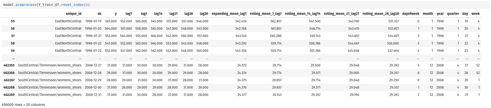
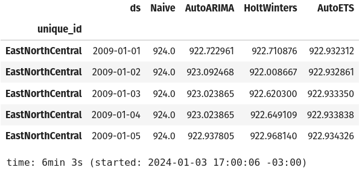
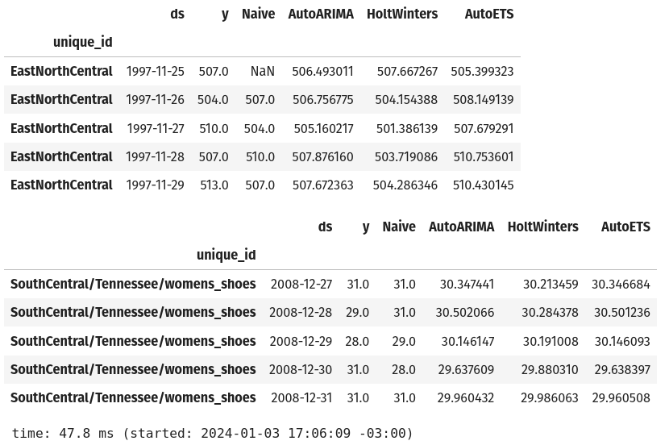
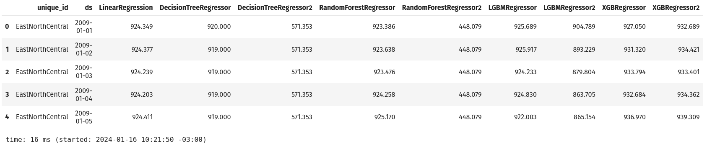
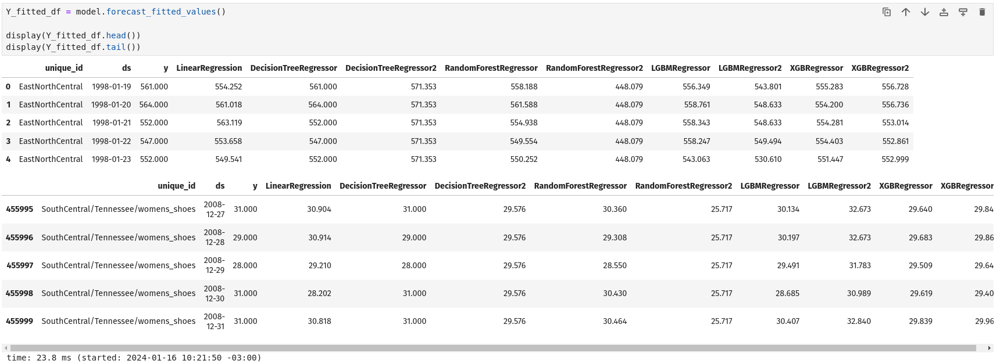
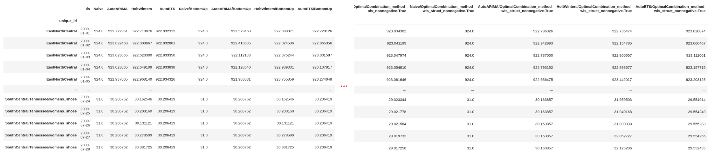
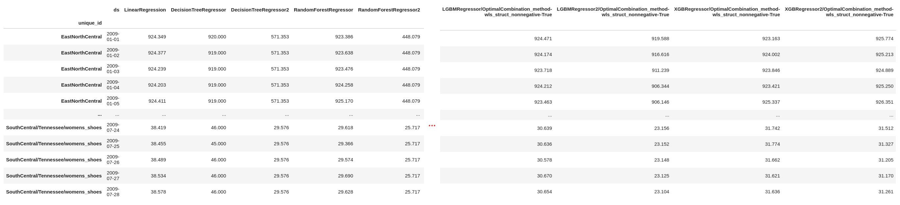
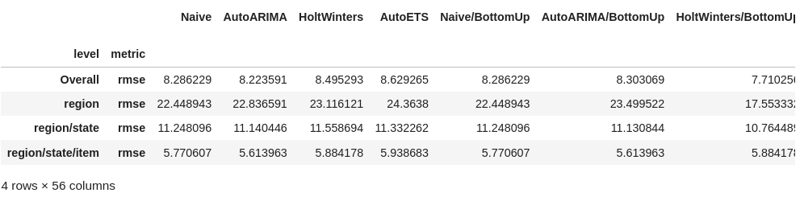
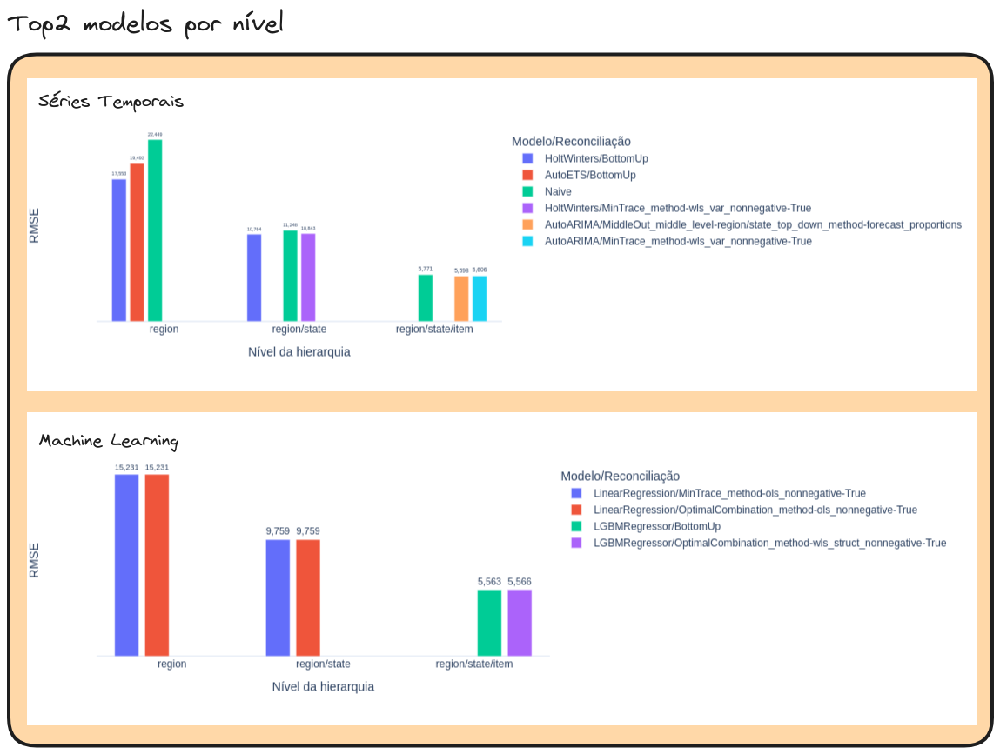

# Projeção de múltiplas séries temporais

Salve! Nesse repositório irei mostrar como podemos fazer projeções múltiplas séries temporais de uma única vez. 

## 1. Dados utilizados

Os dados se referem a venda de roupa no varejo dos USA. Os dados raw podem ser encontrados diretamente nesse [link](https://raw.githubusercontent.com/aws-samples/amazon-sagemaker-hierarchical-forecasting/main/retail-usa-clothing.csv). Abaixo um print da tabela.


**Nosso objetivo é projetar as vendas de roupas no varejo de todas as "combinações/concatenação" das 3 variáveis do dataset: state, item e region**. 

*Obs.: A variável **country** sempre será USA, por isso não iremos considerá-la no estudo.*

## 2. Projeções hierárquicas (hierarchical forecast)

### 2.1. Situação hipotética

Pensa que tu trabalhas nessa empresa de varejo e o seu chefe pediu para você fazer a projeção de quantas vendas terão para os itens que vocês vendem (roupas feminas e masculinos, sapatos, etc...). Você deve imaginar, ok, são apenas 5 ou 6 itens para projetar, dá para modelar cada série individualmente, na mão. 


**Mas** aí você encontra sua primeira dificuldade: as lojas estão espalhadas pelos estados do USA. Logo, agora você não tem somente os 6 itens para modelar e sim os 6 itens dentro de cada estado no banco.


Agora teremos que projetar 108 (6 itens $\times$ 18 estados) séries temporais diferentes. Já pensa ter que modelar uma a uma? Na mão? Trabalhoso né?

> Adendo e provocação: Você pode aplicar métodos automáticos de projeção para cada série, como um AutoARIMA da vida. Certíssimo, eu faria isso. Mas e se o seu chefe te pedir para agregar as projeções somente do estado de Nova York? Será que, quando você fazer a agregação para o nível de estado, as projeções irão ser exatamente iguais?

**Entrando** aí a sua segunda (e última) dificuldade. Não basta ter que projetar as vendas dos itens dentro de cada Estado. Cada estado, vai estar dentro de uma região... Logo, você tem mais um nível de projeção, mas esse não é tão dificultoso assim...


O lado positivo dessa "última dificuldade" é que um Estado só pode estar dentro de uma Região. Logo, não teremos novas combinações. 

**Para** o nosso caso, temos mais um lado positivo. O gráfico abaixo mostra quantas combinações distintas entre as 3 variáveis foram vendidas durante o tempo, ou seja, quantas projeções de vendas teremos que fazer diariamente. Sempre foram 91 combinações e não aquelas 108 que havia comentado anteriormente. Em termos práticos, em alguns estados não são vendidos determinados itens.


### 2.2. Um pouquinho de teoria (na prática)


De forma visual e resumida, a nossa hierarquia de variáveis pode ser representada da maneira acima.

Agora vamos supor que **rodamos modelos** para projetar as vendas para as séries, dentro de cada nível, isto é, vamos fazer as projeções para cada um dos valores que temos dentro dos níveis. Exemplos abaixo:

- Nível I: SouthCentral
- Nível II: SouthCentral/Vermont, SouthCentral/Maine e SouthCentral/Connecticut
- Nivel III:
  - SouthCentral/Vermont/Roupas Femininas, SouthCentral/Vermont/Roupas Masculinas e SouthCentral/Vermont/Roupas Infantil
  - SouthCentral/Maine/Roupas Femininas, SouthCentral/Maine/Roupas Masculinas e SouthCentral/Maine/Roupas Infantil
  - SouthCentral/Connecticut/Roupas Femininas, SouthCentral/Connecticut/Roupas Masculinas e SouthCentral/Connecticut/Roupas Infantil
 
Infelizmente, na hora de agregar os valores nos níveis acima os valores não batem. Para o nosso caso, estamos falando que a projeção das vendas de todos os Estados na Região SouthCentral não batem com as vendas da Região SouthCentral.

```python
Y_hat_df\
    .reset_index()\
    .assign(\
        nivel_hierarquia = lambda x: np.where(x['unique_id'].str.count('/') == 0, 1, x['unique_id'].str.count('/') + 1)
    )\
    .groupby('nivel_hierarquia')[Y_hat_df.select_dtypes(include = 'number').columns]\
    .sum()
```


Na imagem, notem que as resultados das projeções dos níveis não batem. Não achei um motivo específico para isso, minha hipótese é que isso acontença devido a independência das séries devido aos níveis. 

**Para** essas projeções de diferentes níveis baterem, utilizamos a **Reconciliação**:

### 2.3. Reconciliação

Como comentei acima, a Reconciliação é o método que vai fazer a soma das projeções dos diferentes níveis baterem. Ele é um processo após a projeção, como podemos ver na imagem abaixo.

<p>
    
    <em>Retirado de: Hierarchical TimeSeries Reconciliation by Adrien</em>
</p>

Existem uma boa quantidade de métodos de reconciliação. Os principais são:

#### BottomUp


A intuição por trás desse método é, que após a projeção, começaremos a "reestimar" as projeções a partir dos menores níveis até chegar no maior nível. 

#### TopDown


Ao contrário do BottomUp, o TopDown começa o processo de "reestimação" das projeções a partir do maior nível até chegar no menor nível. 

#### MiddleOut


As "reestimações" desse método começam a partir de algum nível intermediário. Para o nosso caso, esse nível deveria ser o nível de Estado (Região/Estado, no código). 

#### Outras

Existem outros métodos que mudam a forma a estratégia de como esse processo de "reestimação" vai acontecer e outras focadas em diminuir o erro. Algumas delas são:

- OptimalCombination
- MinTrace
- ERM
- PERMBU
- Normality
- Bootstrap

## 3. Explorações iniciais

Apenas alguns highlights:

- As datas mais recentes são as que possuem mais vendas
- Tennessee (1.351.608), Kentucky (1.298.425) e California (1.173.635) são os estados com mais vendas
- Vestimentas de mulheres são os itens mais vendidos (11.283.595)
- SouthCentral é a região/regional com maior quantidade de vendas (4.792.847)
- Tennessee/womens_clothing/SouthCentral foi a combinação (variáveis region/state/item) que teve mais vendas durante o período 
- Tendência nas no aumento das vendas no varejo, perceptível a partir dos anos 2000 (ver imagem abaixo)


Dentro da pasta [01-explorations](https://github.com/barbosarafael/multiple-time-series-forecast/tree/main/02-notebooks/01-explorations) tem as análises mais detalhadas. 

## 4. Processo de modelagem

### 4.1. Organização dos dados


As bibliotecas `StatsForecast` e `MLForecast` exigem que os dados estejam formatados de uma maneira bastante específica. 

A primeira modificação é renomear as colunas de data e quantidade de vendas:

```python
#---- 3. Renomeando as variáveis de quantidade de vendas e data:
# date -> ds
# quantity -> y

df = df\
    .rename(columns = {'date': 'ds', 
                       'quantity': 'y'})
```

A segunda modificação é o formato dos dados. Para isso, vamos utilizar a função aggregate. Ela exige dois parâmetros: um dataframe com os dados (ver print acima) e uma lista de lista das hierarquias `[['region'], ['region', 'state'], ['region', 'state', 'item']]`. 

Criei uma função para deixar isso de forma mais simples. 


```python
def format_hierarchical_df(df: pd.DataFrame, cols_hierarchical: list):

    #---- 1. Cria uma lista de listas: [[col1], [col1, col2], ..., [col1, col2, coln]]

    hier_list = [cols_hierarchical[:i] for i in range(1, len(cols_hierarchical) + 1)]

    #---- 2. Aplica a função aggregate que formata os dados em que a lib hierarchical pede

    Y_df, S_df, tags = aggregate(df = df, spec = hier_list)

    return Y_df, S_df, tags
```

Ela retorna 3 objetos. 

**Y_df**: dataframe hierarquico. Notem que foi criado uma série para cada possibilidade dentro dos níveis que havia comentado.


**tags**: dicionário onde as chaves são os níveis (region, region/state e region/state/item) e as chaves as combinações dentro desses níveis.


**S_df**: dataframe/matriz que ajuda na hora de fazer a reconciliação. Identifica se um nível pertence ao outro.

### 4.2. Separação em treino e validação

Sem muito rodeio aqui:

- Treino: 25/11/1997 a 31/12/2008
- Validação: 01/01/2009 a 28/07/2009 (quase 8 meses)

Teremos um **Y_train_df** e um **Y_valid_df**.

### 4.3. Aplicação dos modelo 

Ao total, vamos testar 8 modelos:

- **Baseline**: Naive
- **Clássicos de séries temporais**
  1. HoltWinters
  2. ARIMA
  3. ETS
- **Machine Learning**
  1. Regressão Linear
  2. Árvore de decisão: com e sem tuning
  3. Random Forest: com e sem tuning
  4. LightGBM: com e sem tuning
  5. XGBoost: com e sem tuning

#### Séries Temporais

Iremos utilizar a lib `statsforecast`, que contém os modelos. O notebook com esses resultados podem ser encontrados em [01-baseline_and_ts_models.ipynb](https://github.com/barbosarafael/multiple-time-series-forecast/blob/main/02-notebooks/02-baseline_and_ts/01-baseline_and_ts_models.ipynb). Primeiro, vamos definir os modelos que iremos utilizar e instanciá-los.

```python
from statsforecast import StatsForecast
from statsforecast.models import Naive, AutoARIMA, HoltWinters, AutoETS

naive = Naive() # baseline
arima = AutoARIMA(season_length = 7) # ARIMA com sazonalidade de 7 dias
hw = HoltWinters(season_length = 7, error_type = 'M') # Holtwinters com sazonalidade de 7 dias e erro do tipo Aditivo
ets = AutoETS(season_length = 7) # ETS com sazonalidade de 7 dias

model = StatsForecast(models = [naive, arima, hw, ets], freq = 'D', n_jobs = -1)
model.fit(Y_train_df)
```

Notem que passei um parâmetro de identificação de sazonalidade de 7 dias. 

Após isso, passamos para a função `StatsForecast` os modelos, a frequência, que será Diária, e quantos cores de CPU serão utilizados para o processo, -1 significa todos. E no fim o `.fit` aplicando os modelos nos dados de treino.

No fim ele mostra somente o seguinte output:

```
StatsForecast(models=[Naive,AutoARIMA,HoltWinters,AutoETS])
```

> Um adendo aqui, na documentação da lib, eles aceitam dataframes do Pandas, Spark, Dask e Ray. Li em algum local que estão começando a desenvolver para aceitar em Polars também.

#### Machine Learning

Para a parte de ML, teremos um mix de bibliotecas dos modelos (qualquer um que seja `.fit` e `.transform`), como o `scikit-learn`, `lightgbm` e `xgboost`. E também temos a `MLForecast` que irá fazer o processo de modelagem. 

Mas antes de aplicar esses modelos fiz um tuning dos modelos antes. Onde temos um notebook para cada tuning dos modelos:

- [Árvore de decisão](https://github.com/barbosarafael/multiple-time-series-forecast/blob/main/02-notebooks/03-ml-models/02-tuning-dec-tree.ipynb)
- [Random Forest](https://github.com/barbosarafael/multiple-time-series-forecast/blob/main/02-notebooks/03-ml-models/03-tuning-random-forest.ipynb)
- [LGBM](https://github.com/barbosarafael/multiple-time-series-forecast/blob/main/02-notebooks/03-ml-models/04-tuning-lgbm.ipynb)
- [XGBoost](https://github.com/barbosarafael/multiple-time-series-forecast/blob/main/02-notebooks/03-ml-models/05-tuning-xgboost.ipynb)

E salvei os hiperparâmetros na pasta [03-best-params](https://github.com/barbosarafael/multiple-time-series-forecast/tree/main/03-best-params). O processo de tuning dos modelos foi baseado no post do [Mario Filho](https://github.com/ledmaster), [Multiple Time Series Forecasting With LightGBM In Python](https://forecastegy.com/posts/multiple-time-series-forecasting-with-lightgbm-in-python/#tuning-lightgbm-hyperparameters-with-optuna).

Já que estamos falando de modelos de ML, podemos adicionar novas features para melhorar (ou não) o desempenho do modelo. Em séries temporais, as mais comuns são features que extraímos da data, como o dia da semana, dia do ano, semana do ano e etc, para identificar sazonalidade, tendência e padrões de datas anteriores. No `MLForecast` existe um parâmetro que você passa quais dessas features você deseja e ele mesmo extrai, em vez de ter que criar "na mão" com o Pandas. 

```python
date_features = ['dayofweek', 'month', 'year', 'quarter', 'day', 'week'] # Features de data`
```

Outras features que podem ser extraídas são versões passadas da sua própria variável resposta (y), que são chamadas de *lag* ou *diff*. Que também são facilmente extraídas pelo `MLForecast`. 

```python
lags = [1, 7, 14, 21, 28, 30] # Criação de novas features de lags de 1, 7, ..., 30 dias da variável resposta
```

Podemos extrair também features de médias móveis, médias móveis sazonais, entre outras. Dependendo claro de quantos dias você vai querer que seja feito o cálculo da média móvel. O que é bem acessível de fazer com a ajuda das libs `window_ops` com o `numba`.

```python
#---- Features de data:

from numba import njit
from window_ops.expanding import expanding_mean
from window_ops.rolling import rolling_mean

@njit
def rolling_mean_7(x):
    return rolling_mean(x, window_size = 7)

@njit
def rolling_mean_14(x):
    return rolling_mean(x, window_size = 14)

@njit
def rolling_mean_21(x):
    return rolling_mean(x, window_size = 21)

@njit
def rolling_mean_28(x):
    return rolling_mean(x, window_size = 28)
```

Com isso, podemos aplicar todos esses parâmetros na nossa principal função, `MLForecast`, que fará o processo do `.fit`. 

```python
models_list = [lin_reg, dec_tree, tun_dec_tree, ran_forest, tun_ran_forest, lgbm, tun_lgbm, xgb, tun_xgb]

model = MLForecast(models = models_list, # Lista com 9 modelos
                   freq = 'D', # Frequência diária
                   num_threads = 6,
                   lags = [1, 7, 14, 21, 28, 30], # Criação de novas features de lags de 1, 7, ..., 30 dias da variável resposta
                   date_features = ['dayofweek', 'month', 'year', 'quarter', 'day', 'week'], # Features de data
                   lag_transforms = {
                       1: [expanding_mean],
                       7: [rolling_mean_7],
                       14: [rolling_mean_14],
                       21: [rolling_mean_21],
                       28: [rolling_mean_28],
                   }
           )

model.fit(Y_train_df.reset_index(), id_col = 'unique_id', time_col = 'ds', target_col = 'y', fitted = True)
```

Com o objeto `model` conseguimos acessar um método chamado `.preprocess` e visualizar um dataframe Pandas com o que foi treinado pelo modelo.

```python
model.preprocess(Y_train_df.reset_index())
```



> Mais um adendo aqui. A nossa série inicia em 25/11/1997 mas no dataframe acima, os dados começam a ser treinados a partir do dia 19/01/1998. Não faz muito sentido. São 55 dias entre as duas datas e nenhum dos parâmetros que passei corresponde a esse valor 


### 4.4. Predict do modelo

#### Séries Temporais

```python
n_horizon = Y_valid_df.ds.nunique() # Quantidade de dias para a projeção

Y_hat_df = model.forecast(h = n_horizon, fitted = True)

Y_hat_df.head()
```



A quantidade de dias para a projeção peguei diretamente da documentação, por isso o jeitinho diferente. O `fitted = True` vai servir para criarmos um novo dataframe com o que o modelo projetou para os dados de treino.

```python
Y_fitted_df = model.forecast_fitted_values()

display(Y_fitted_df.head())
display(Y_fitted_df.tail())
```



#### Machine Learning


```python
Y_hat_df = model.predict(h = n_horizon)
```

O que difere entre as projeções é o método utilizado dentro `model`, um é `predict` ou outro é `forecast`.



Dentro do `.fit` do modelo passamos um parâmetro de `fitted = True` também, com o mesmo objetivo dos modelos de Séries Temporais. E com o mesmo código temos o mesmo resultado.



### 4.5. Reconciliação

Com a lib `hierarchicalforecast` facilmente podemos fazer o processo de reconciliação. Lembrando que esse ŕé um processo pós-modelagem.

```python

from hierarchicalforecast.methods import BottomUp, TopDown, ERM, OptimalCombination, MinTrace, MiddleOut
from hierarchicalforecast.core import HierarchicalReconciliation

reconcilers = [BottomUp(), 
               TopDown(method = 'forecast_proportions'),
               TopDown(method = 'average_proportions'),
               TopDown(method = 'proportion_averages'),
               MiddleOut(middle_level = 'region/state', top_down_method = 'forecast_proportions'),
               MiddleOut(middle_level = 'region/state', top_down_method = 'average_proportions'),
               MiddleOut(middle_level = 'region/state', top_down_method = 'proportion_averages'),
               MinTrace(method = 'ols', nonnegative = True),
               MinTrace(method = 'wls_struct', nonnegative = True),
               MinTrace(method = 'wls_var', nonnegative = True),
               MinTrace(method = 'mint_shrink', nonnegative = True),
               OptimalCombination(method = 'ols', nonnegative = True),
               OptimalCombination(method = 'wls_struct', nonnegative = True)
              ]

hrec = HierarchicalReconciliation(reconcilers = reconcilers)

Y_rec_df = hrec.reconcile(Y_hat_df = Y_hat_df, # Dataframe com as projeções cruas
                          Y_df = Y_fitted_df, # Dataframe com as estimações do modelo nos dados de treino
                          S = S_df, # Sparse dataframe (0 ou 1) de cada combinação
                          tags = tags)

```

Pensando que estamos aqui para experimentar, vamos testar (quase) todos os métodos de reconciliação que tem disponíveis na lib. 

Primeiramente adicionamos em uma lista todos os métodos de reconciliação que queremos utilizar, logo após passamos eles para a função `HierarchicalReconciliation`. Essa parte de reconciliação é semelhante nos modelos de Séries Temporais e de Machine Learning. 

#### Séries Temporais



#### Machine Learning




Agora, com os métodos de reconciliação, temos 151 modelos diferentes que podemos analisar para identificar qual se aproxima mais das vendas realizadas. 

> Já já vocês virão que os resultados desses métodos de reconciliação são muito próximos entre eles ou muito distante das vendas realizadas. 

## 5. Avaliação dos modelos

Agora que já nossas versões finais dos modelos, podemos efetivamente comparar o que eles projetaram com os nossos dados de vendas realizadas. 

Das métricas convencionais, iremos utilizar o RMSE. 

### 5.1. RMSE


Métrica clássica de problemas de regressão dentro do Machine Learning e Estatística. A intuição por trás dele é: a média dos erros do seu modelo, em comparação com o que foi realizado. 

Para o nosso contexto, isso significa que esses erros serão avaliados calculados nos dias dos nossos dados de validação, entre 01/01/2009 a 28/07/2009. 


```python

from hierarchicalforecast.evaluation import HierarchicalEvaluation

def rmse(y_true, y_pred):
    
    return np.sqrt(np.mean(np.square(y_true - y_pred)))

evaluator = HierarchicalEvaluation(evaluators = [rmse])

evaluation = evaluator.evaluate(
    Y_hat_df = Y_rec_df,
    Y_test_df = Y_valid_df,
    tags = tags
)
```




Com isso, o nosso objeto `evaluation` tem uma carinha parecida com o dataframe da imagem acima. Ele calcula o RMSE por nível e também geral para cada modelo.

Para ficar mais fácil identificar quais os melhores modelos, i.e, os que tem menor RMSE, criei esses dois gráficos.



No geral, o melhor modelo são os de Machine Learning, em específico a Regressão Linear, são os melhores, pois possuem menor RMSE, em comparação com a Baseline e os modelos de Séries Temporais. 

E, como eu comentei anteriormente. As métricas entre os modelos ficam muito parecidos. 

### 5.2. Comparação gráfica


Uma comparação mais "olhométrica", iremos ver como as projeções estão se comportando em comparação com o que foi vendido. 


## 6. Tabela final


## 7. Feature importance

## 8. Modelo em produção

## 9. Referências

Melhorias: 

- Extrair features de feriados
- - Adicionar os intervalos de confiança
- Modelar com alguma transformação: como box-cox ou raiz quadrada